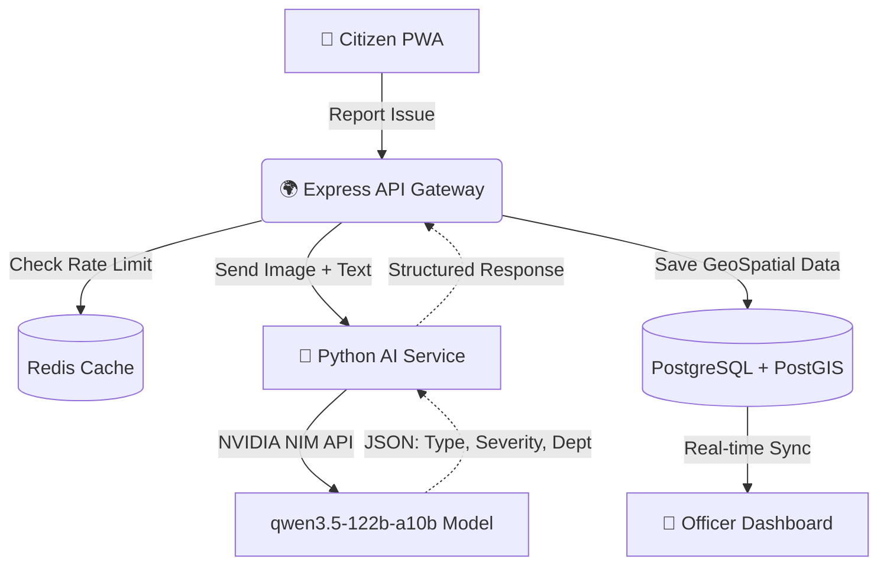

<div align="center">


# 🦸‍♂️ Community Hero

**Empowering Citizens. Enabling Cities. Elevated by AI.**

[](https://reactjs.org/)
[](https://vitejs.dev/)
[](https://nodejs.org/)
[](https://postgresql.org/)
[](https://nvidia.com/)
[](https://docker.com/)

[**Explore the Features**](#-key-features) • [**Architecture**](#-architecture--data-flow) • [**Getting Started**](#-getting-started) • [**Deployment**](#-deployment-guide)

</div>

---

## 📖 Overview

**Community Hero** is a next-generation civic infrastructure platform built to modernize how cities identify, triage, and resolve public issues. Gone are the days of filling out long forms and waiting in telephone queues. 

With Community Hero, a citizen snaps a photo of a pothole, and our **NVIDIA NIM-powered AI** instantly processes the image, determines the severity, tags the exact GPS coordinates, and routes it to the correct municipal department—all within seconds.

---

## ✨ Key Features

| 🏙️ **Citizen App (PWA)** | 👮 **Officer Console** | 👑 **Admin Dashboard** |
| :--- | :--- | :--- |
| **Instant AI Triage**<br/>Upload photos for auto-classification of issue type, severity, and department. | **Field Execution**<br/>Data-dense, professional tables optimized for tracking operational tasks. | **City-Wide Oversight**<br/>Manage all departments, officers, and wards from a single interface. |
| **Gamified Civic XP**<br/>Earn XP and unlock badges for verifying community reports. | **SLA Monitoring**<br/>Color-coded alerts for issues nearing their SLA (Service Level Agreement) deadlines. | **Advanced Filtering**<br/>Filter issues by AI confidence score, real-time status, and physical location. |
| **"Auto-Locate Me"**<br/>HTML5 Geolocation instantly snaps the map pin to your physical location. | **Media Evidence**<br/>Review citizen-uploaded imagery before dispatching field teams. | **AI Cluster Analytics**<br/>Identify overlapping duplicate reports to prevent redundant resource dispatch. |

---

## 🏗️ Architecture & Data Flow

Community Hero relies on a highly decoupled microservice architecture optimized for speed, geographic querying, and AI inference.



### 🛡️ Enterprise Security & Performance
- **Express Rate Limiting**: The public submission endpoint (`POST /api/issues`) is strictly rate-limited to 5 requests per minute to prevent malicious spamming.
- **AI Content Guardrails**: All text input is filtered through an NVIDIA LLM guardrail to block hate speech, prompt injections, and irrelevant spam.
- **Dual-Write Authentication**: Firebase handles secure OAuth, while PostgreSQL serves as the undisputed source of truth for Role-Based Access Control (RBAC).
- **Gzip Compression**: All heavy GeoJSON API responses are heavily compressed to ensure lightning-fast map rendering.

---

## 📂 Project Structure

```text
community-hero/
├── frontend/           # React 18, Vite, Tailwind CSS, Leaflet, Zustand
├── backend/            # Node.js, Express, Rate Limiting, Helmet Security
├── ai-service/         # Python FastAPI wrapper for NVIDIA NIM inference
├── db/                 # PostgreSQL initialization & PostGIS setup
├── .env                # Centralized Environment Variables
└── docker-compose.yml  # Local infrastructure orchestration
```

---

## 🚀 Getting Started

### Prerequisites
Ensure you have **Node.js (v18+)**, **Docker**, and **Python 3.10+** installed. You will also need a free NVIDIA API key and a Firebase project for authentication.

### 1. Configuration
Create a `.env` file at the root of the project. This single file powers the Frontend, Backend, and AI Service:
```env
PORT=8000
NVIDIA_API_KEY=nvapi-your-key-here
NVIDIA_MODEL=qwen/qwen3.5-122b-a10b
NVIDIA_BASE_URL=https://integrate.api.nvidia.com/v1
CORS_ORIGINS=http://localhost:5173
ENVIRONMENT=development
```

### 2. Boot Local Infrastructure
Start the PostgreSQL (with PostGIS) and Redis containers:
```bash
docker-compose up -d postgres redis
```

### 3. Start the Microservices
Open three separate terminal windows and run the following commands:

**Terminal 1 (Backend API):**
```bash
cd backend
npm install && npm run dev
```

**Terminal 2 (AI Service):**
```bash
cd ai-service
pip install -r requirements.txt
uvicorn app.main:app --host 0.0.0.0 --port 8001 --reload
```

**Terminal 3 (Frontend Web App):**
```bash
cd frontend
npm install && npm run dev
```

Visit `http://localhost:5173` in your browser. Welcome to Community Hero! 🎉

---

## 🌐 Deployment Guide

To deploy this application to production, we recommend using a combination of **Vercel** (for the frontend) and **Railway** or **Render** (for the backend and AI services).

1. **Database Setup**: Provision a managed PostgreSQL database with the PostGIS extension (e.g., Supabase, Neon, or Railway). Execute the `db/init.sql` schema to initialize your tables.
2. **Backend & AI Services**: Deploy both `backend` and `ai-service` as Dockerized Web Services on Render/Railway. Provide them with your centralized `.env` variables.
3. **Frontend Application**: Connect your GitHub repository to Vercel. Set the Root Directory to `frontend` and the Framework to `Vite`. Crucially, add `VITE_API_URL` and `VITE_AI_SERVICE_URL` to your Vercel Environment Variables pointing to the live services deployed in step 2.
4. **Firebase Domains**: Finally, ensure your new Vercel domain is added to your Firebase project's "Authorized Domains" list to allow production authentication.

---
<div align="center">
  <p><i>Building the cities of tomorrow, together.</i></p>
</div>
