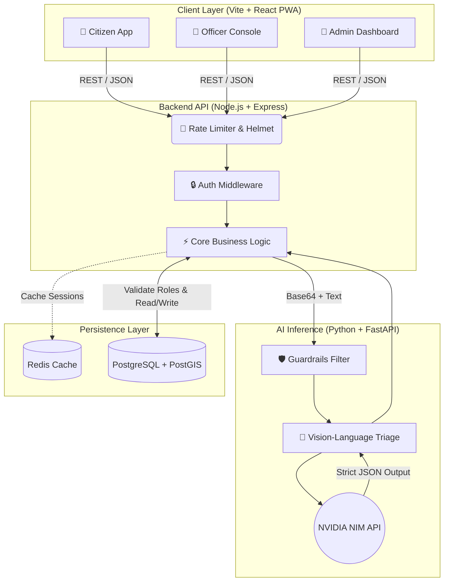
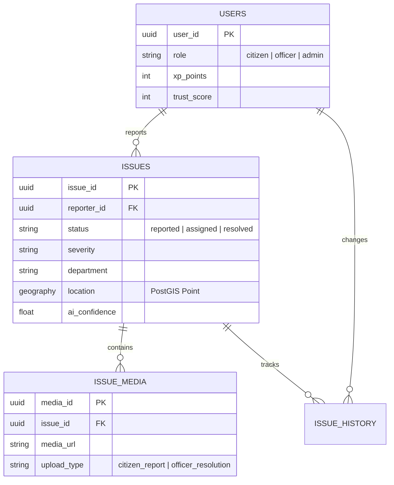

<div align="center">


# 🦸‍♂️ Community Hero

**A Next-Generation, AI-Driven Civic Infrastructure Platform.**

[](https://reactjs.org/)
[](https://vitejs.dev/)
[](https://nodejs.org/)
[](https://postgis.net/)
[](https://nvidia.com/)
[](https://tailwindcss.com/)

[**Working Process**](#-deep-dive-how-it-works) • [**Architecture**](#-system-architecture) • [**Database Schema**](#-database-entity-relationships) • [**Getting Started**](#-getting-started)

</div>

---

## 📖 Executive Summary

**Community Hero** replaces archaic, manual municipal ticketing systems with a highly automated, AI-first Progressive Web Application (PWA). 

When a citizen reports a civic issue (e.g., a downed power line), the platform utilizes **NVIDIA LLMs** to visually and textually analyze the report in milliseconds. It determines the severity, tags the geographic coordinates, checks for nearby duplicate reports using **PostGIS**, and automatically routes the ticket to the correct municipal department queue.

---

## 🧠 Deep Dive: How It Works (The Working Process)

Community Hero isn't just a CRUD app; it features complex, asynchronous pipelines designed for scale.

### 1. The AI Triage Engine (NVIDIA NIM)
Instead of forcing citizens to fill out confusing drop-down forms, they simply take a photo and write a natural language description.
* **The Process**: The Node.js backend intercepts the HTTP request and forwards the Base64 image and text to our dedicated Python Microservice (`ai-service`).
* **The AI**: The Python service queries the `qwen3.5-122b-a10b` vision-language model via the **NVIDIA NIM API**. We utilize strict system prompting to force the LLM to return a deterministic JSON object containing: `issue_type`, `severity`, `department`, `confidence_score`, and `public_safety_risk`.
* **Guardrails**: Before processing, the text is run through an AI Guardrail to instantly reject hate speech, spam, or prompt injection attacks.

### 2. Geospatial Clustering (PostGIS)
Municipalities waste thousands of hours responding to duplicate reports of the same pothole.
* **The Process**: When an issue is approved, the backend queries the PostgreSQL database using the PostGIS `ST_DWithin` function. 
* **The Logic**: It scans for any existing active issues of the same `issue_type` within a 50-meter radius of the incoming geographic coordinates. If found, the incoming report is flagged as a "Duplicate Candidate" to prevent redundant officer dispatch.

### 3. Dual-State Authorization Flow
Authentication is notoriously difficult in Dockerized microservices. We solved this with a hybrid approach.
* **The Process**: The Frontend uses **Firebase Auth** (Google OAuth/Email) to generate secure JWTs.
* **The Validation**: The Express backend verifies the JWT using the Firebase Admin SDK. However, to avoid Google Cloud metadata timeouts and ensure split-second routing, **User Roles (Citizen, Officer, Admin)** are cached and strictly enforced by the PostgreSQL database.

### 4. Background SLA Monitoring
Critical issues (like water main breaks) have strict Service Level Agreements (SLAs).
* **The Process**: A custom Node.js asynchronous worker runs on an interval (`setInterval`). It scans the database for issues in the `assigned` state that have exceeded their `recommended_sla_hours`.
* **The Action**: If an SLA is breached, the worker automatically escalates the issue severity and logs an infraction on the responsible Officer's record.

---

## 🏗️ System Architecture

Our microservice architecture separates the heavy AI compute from the high-throughput transactional database.



---

## 🗄️ Database Entity Relationships

Our relational database is normalized to support high-velocity geographic queries and strict audit logs.



---

## 🚀 Getting Started (Local Development)

### 1. Unified Configuration
We use a single, unified `.env` file at the root of the project to ensure the Frontend, Backend, and Python AI Service are always perfectly synchronized.

Create `.env` in the root directory:
```env
PORT=8000
NVIDIA_API_KEY=your_nvidia_api_key_here
NVIDIA_MODEL=qwen/qwen3.5-122b-a10b
NVIDIA_BASE_URL=https://integrate.api.nvidia.com/v1
CORS_ORIGINS=http://localhost:5173
ENVIRONMENT=development
```

### 2. Boot Local Infrastructure
Use Docker Compose to provision the PostgreSQL (with PostGIS extensions) database and the Redis cache.
```bash
docker-compose up -d postgres redis
```

### 3. Start the Microservices
Open three separate terminal windows to run the stack concurrently:

**Terminal 1 (Node.js Backend):**
```bash
cd backend
npm install
npm run dev
```

**Terminal 2 (Python AI Service):**
```bash
cd ai-service
pip install -r requirements.txt
uvicorn app.main:app --host 0.0.0.0 --port 8001 --reload
```

**Terminal 3 (React Frontend PWA):**
```bash
cd frontend
npm install
npm run dev
```

Navigate to `http://localhost:5173` to explore the platform!

---

## 🌐 Production Deployment Guide

To deploy Community Hero to the internet, follow this highly-available architecture strategy:

1. **Database Tier**: Provision a managed PostgreSQL instance with the PostGIS extension enabled (e.g., **Supabase**, **Neon**, or **Railway**). Execute `db/init.sql` to build the schema.
2. **AI & API Services (Render or Railway)**: Deploy the `backend` and `ai-service` directories as separate Dockerized web services. Ensure your unified `.env` variables are applied to both.
3. **Frontend Tier (Vercel)**: Connect your GitHub repository to Vercel, targeting the `frontend` folder. Vite will automatically build the PWA.
   - *Crucial*: Ensure `VITE_API_URL` and `VITE_AI_SERVICE_URL` point to your newly deployed backend services.
   - *Crucial*: To support React Router, configure Vercel to rewrite all routes to `index.html`.
4. **Firebase Configuration**: Add your new Vercel domain to your Firebase project's "Authorized Domains" list to ensure OAuth Google Sign-In functions securely in production.

---
<div align="center">
  <p><i>Building the smart cities of tomorrow, together.</i></p>
</div>
